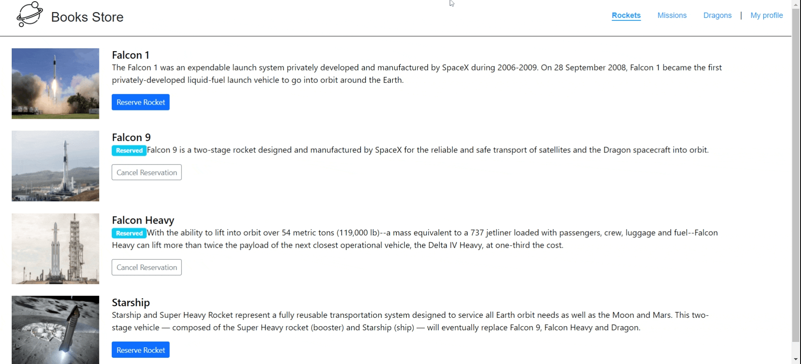

# rocket space missions

> Rockets

The Rockets section displays a list of all available SpaceX rockets. Users can book each rocket by clicking the reservation button or cancel the previously made booking.

> Missions

The Missions section displays a list of current missions along with their brief description and participation status. There is also a button next to each mission that allows users to join the selected mission or leave the mission the user joined earlier.

> Dragons

The dragons section displays a list of all available SpaceX dragons. Users can book each rocket by clicking the reservation button or cancel the previously made booking.

> My Profile

The My Profile section displays all reserved rockets, space missions and dragons.

## Built With

- ReactJS
- Redux
- react-bootstrap

## Getting Started

start by cloning the repository.

`git clone https://github.com/omarsalem7/space-app.git`

cd to the folder.

`cd space-app`

install all the dependencies.

`npm install`

run the live server

`npm run start`

go to [http://localhost:3000](http://localhost:3000)

build the distribution folder before hosting the app

`npm run build`

after the build you can host the `build` folder.

## Authors

👤 **Omar Salem**

- GitHub: [Omar Salem](https://github.com/omarsalem7)
- Twitter: [Omar Salem](https://twitter.com/Omar80491499)
- LinkedIn: [Omar Salem](https://www.linkedin.com/in/omar-salem-a6945b177/)

👤 **Josphat Nkonde**

- GitHub: [@zairdon20](https://github.com/zairdon20)
- Twitter: [@Josphat1](https://twitter.com/Josphat1)
- LinkedIn: [@Josphat Nkonde](https://www.linkedin.com/in/josphat-nkonde-092510183/)

## 🤝 Contributing

Contributions, issues, and feature requests are welcome!

Feel free to check the [issues page](../../issues/).

## Show your support

Give a ⭐️ if you like this project!!!!
